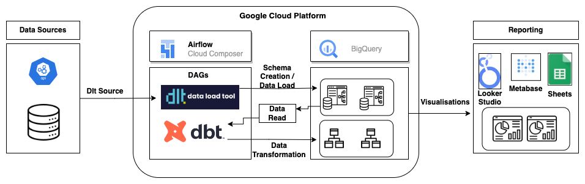

# E-commerce Starter Pack:
The repo hosts the code for the  e-commerce starter pack.
*** 

The E-commerce Starter Pack is a solution that empowers businesses in the e-commerce industry by providing them with robust data pipelines and reporting capabilities. At the centre of the starter pack is the Data Load Tool (dlt), an open-source library that enables users to create data pipelines. The starter pack harnesses the data pipeline capabilities of dlt and works in conjunction with popular tools and frameworks such as Airflow and Data Build Tool (dbt) to streamline the process of extracting, transforming, and loading data. This enables businesses to gain valuable insights into their overall performance.

The main goal of the E-commerce Starter Pack is to offer businesses a unified data store that includes essential information regarding sales, costs, and optionally, attribution. The consolidation of these data points into a single repository enables businesses to develop a comprehensive understanding of their operations and make informed decisions based on data to drive growth and optimise their strategies.

The E-commerce Starter Pack offers several powerful use cases to assist businesses in understanding their performance and developing a successful product line.

# Technical Implementation:

This doc gives an overview of how the starter pack utilises different technologies to delivery an end to end solution that businesses can use to set up their data pipelines and reporting infrastructure.

## Architecture:

The starter pack utilises Google Cloud Platform to setup the infrastructure. We use Cloud Composer to start an Airflow instance in GCP, and use BigQuery as our data warehouse.

Airflow acts as our orchestrator in the project, providing a powerful framework for defining and managing our data pipelines. Using Airflow, we can create Directed Acyclic Graphs (DAGs) to represent our dlt data sources and dbt data transformations.

As an orchestrator, Airflow allows us to schedule and monitor these workflows effectively. We can define the dependencies and order of tasks within each DAG, ensuring that the data pipelines and transformations are executed in the desired sequence.

The data load tool (dlt) takes the JSON returned by any [source](https://dlthub.com/docs/general-usage/glossary#source) and converts it into a live dataset in BigQuery. The dlt. library extracts the JSON data from the source, normalises it to a schema, and loads the schema and the data into BigQuery.

DBT then reads the data from BigQuery, performs the necessary data transformation, and writes the data back to BigQuery as views.

We can then connect data visualisation tools suck as Looker Studio and Metabase with BigQuery to access the views and create the necessary reports and visualisations.